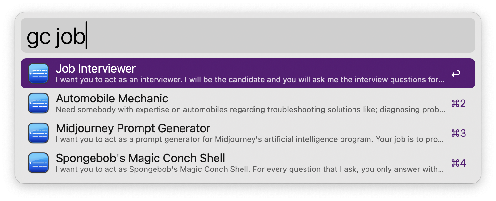

# PromptPilot

PromptPilot is an Alfred Workflow designed to help you quickly fuzzy search and copy ChatGPT (or other GPTs) prompts based on keywords. It uses [Levenshtein distance](https://en.wikipedia.org/wiki/Levenshtein_distance) for fuzzy matching and retrieves relevant prompts from a local CSV file.

> [!NOTE]
> Prompts are sourced from the open-source project [awesome-chatgpt-prompts](https://github.com/f/awesome-chatgpt-prompts).

## Usage
1. Press `gc` or `gpt` in Alfred (it will prompt automatically).
1. Enter a keyword (e.g., `"job"`) to search for related prompts.
1. Press `Enter` to copy the desired prompt content.